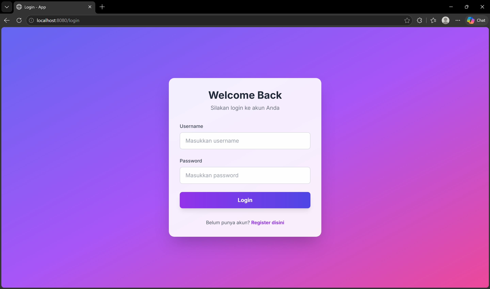
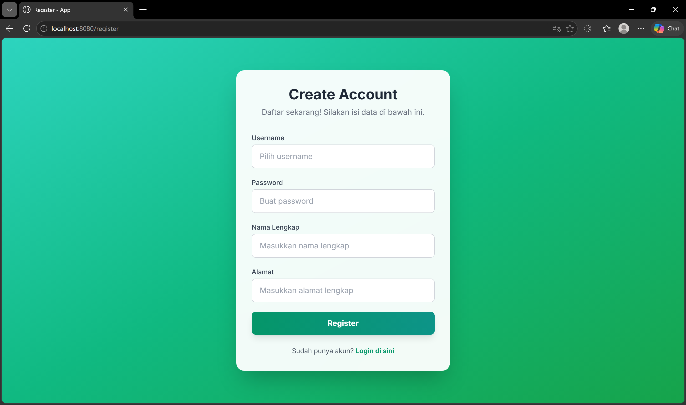
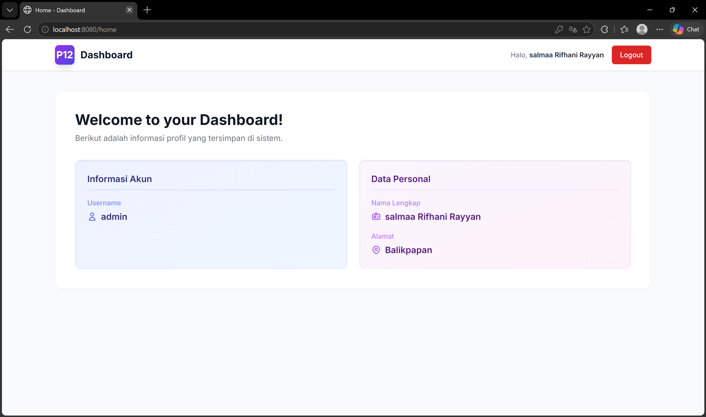
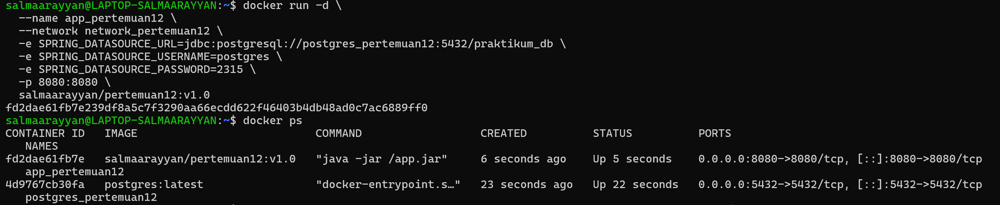
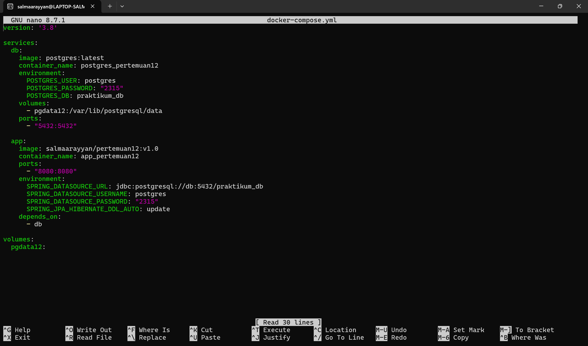
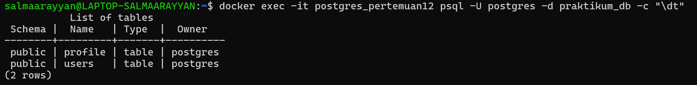
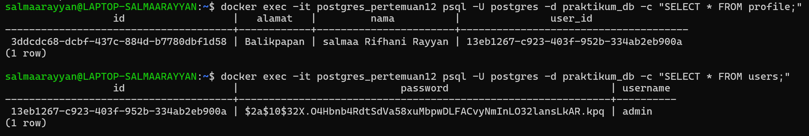

# Pertemuan 12 - Spring Boot App Deployment

## 1. Tampilan Antarmuka Web (UI)

Berikut adalah antarmuka web aplikasi yang sudah didesain secara modern menggunakan Tailwind CSS.

### Halaman Login
Halaman untuk masuk bagi user yang sudah terdaftar.

### Halaman Register
Halaman pembuatan akun baru yang membutuhkan data username, password, nama lengkap, dan alamat.

### Halaman Home / Dashboard
Halaman profil pengguna yang akan terbuka setelah proses login berhasil dilakukan.

---

## 2. Environment & Deployment (WSL & Docker)

Aplikasi dan database dijalankan di dalam environment WSL menggunakan bantuan Docker Compose.

### Running App di WSL
Tangkapan layar proses berjalannya aplikasi Spring Boot di dalam terminal WSL.

### Konfigurasi `docker-compose.yml`
Tangkapan layar isi file `docker-compose.yml` yang mengatur service untuk database PostgreSQL.

---

## 3. Database PostgreSQL

### Struktur Tabel dan Kolom
Tangkapan layar yang menunjukkan struktur tabel.

### Isi Data pada Tabel
Bukti data *User* dan *Profile* yang berhasil tersimpan ke dalam database setelah melakukan registrasi.

